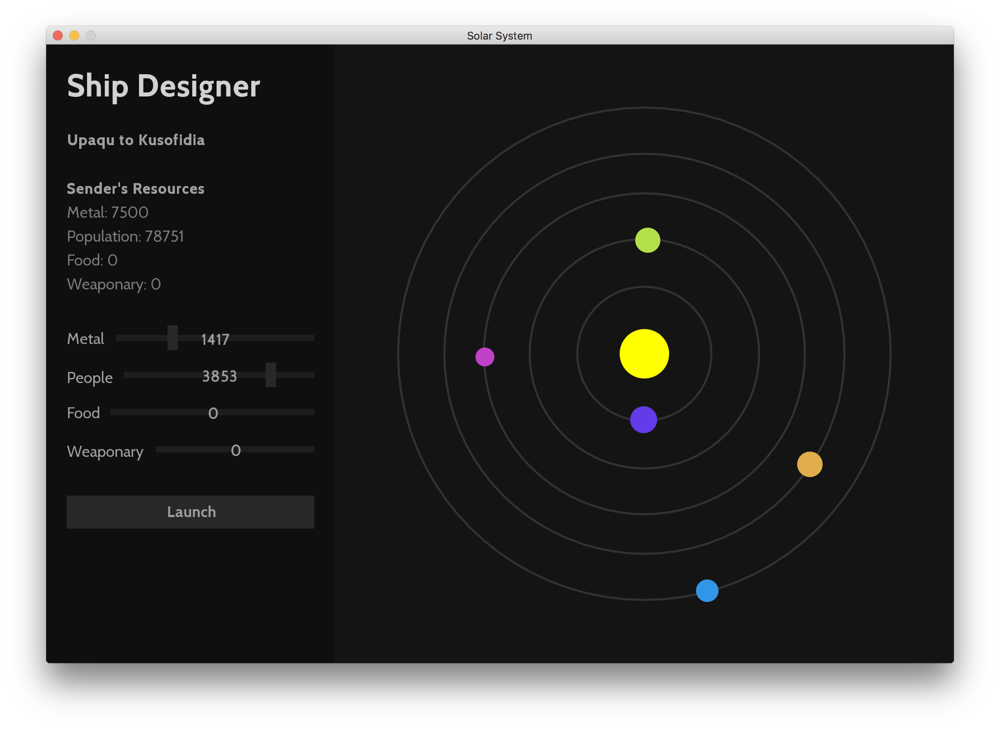

# Solar System

Solar System is a strategy arcade game written with SFML, in which you have to send resources to and
from planets to try to keep the resource balance even to prevent planets from attacking each other.

It's in very early development at the moment, so it's definitely not very polished, and most of the
features I want aren't implemented yet. However, it is just about ~~playable~~ usable: you can transfer
resources from one planet to another by dragging from the sender planet to the destination.

In the future I want to add these features:

 - **Random initial resources depending on planet properties**, e.g. a large planet would probably have
    a higher population, metal supply, etc.. than a smaller planet.
    
 - **Population increasing/decreasing**. i.e. population increases (exponentially?) over time,
    and if a planet is running low on food, *(or high on weaponary?,)* the population will decrease.
   
 - Some kind of **time scale**, e.g. 1 year = 2 minutes.
 
 - **Inter-planetary relations**, i.e. if planet A sends loads of resources to planet B, planet B will
    like planet A more, but if they don't send anything back planet A will get a bit angry.
    
 - **Better planet generation**. Currently, planet names are terrible, and properties seem a bit
    random (because they are). It'd be nice to have better name generation, and have
    properties slightly based on other properties (e.g. population ∝ planet size.)
 
 - Many **more planet properties**. Some ideas:
    - Biodiversity
    - Type (urban, rural, etc...)
    - **resource:** Technology
    
 - **Properties specific to populations**, such as intelligence and how easily they become angry at other
    planets. This would involve a change of some sort to the way I currently store population (as a
    resource.)
    
 - **Wars**: If a planet gets angry at another they might start a war. This will involve (against the
    player's will) the two planets sendings ships back and forth to plunder resources, and firing missiles
    in an attempt decimate the population. If a planet's population gets too low in a war, they can
    surrender, but they'll have to sign a treaty (maybe sending 75% of their resources every year for
    the next n years.) Technological advances might also be faster in wartime.